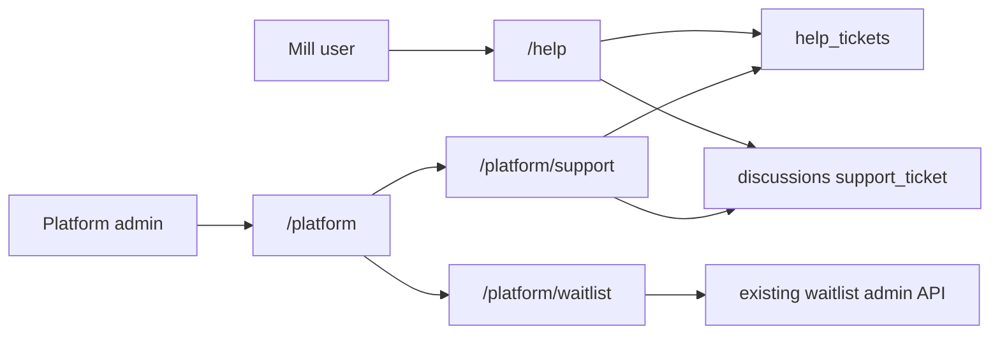

# Help as vendor support + platform admin shell — design spec

**Date:** 2026-08-20  
**Status:** Approved (implementation reference)

## Problem

Mill `/help` lists all workspace tickets to every member, has no reply thread, and Makorsha staff have no in-app inbox. Waitlist admin is env-email only with no ERP UI.

## Decision

- Mill users **file** tickets; **Makorsha staff** reply via discussions.
- **`profiles.is_platform_admin`** gates platform shell (not env emails for Help).
- Mill list visibility: **creator** sees own; **`owner`** + **`ground-team-manager`** see all.
- Reuse **`DiscussionThread`** with entity type **`support_ticket`** (matches attachment enum).
- Status stays **`open` / `closed`** only; no notifications this pass.
- Two surfaces: mill **`/help`** + **`/platform`** shell (**Support** + **Waitlist**).
- Waitlist admin API: **`is_platform_admin`** or legacy **`WAITLIST_ADMIN_EMAILS`** (transition).

## Architecture

### Staff workspace context

`GET /platform/help/tickets` is **cross-workspace** (no membership check). Opening a ticket in Support inbox, frontend **switches `X-Workspace-ID`** to the ticket's `workspace_id` so discussions, attachments, and PATCH close/reopen use existing workspace-scoped endpoints.

**Platform admin workspace bypass:** `get_current_workspace` allows **`is_platform_admin`** users to set `X-Workspace-ID` to any valid workspace without membership — required for staff to reply on mill tickets they do not belong to.

## Backend

### Migration `115_platform_admin`

- Add `profiles.is_platform_admin` boolean NOT NULL default `false`.
- Bootstrap: one-time SQL, e.g. `UPDATE profiles SET is_platform_admin = true WHERE email = 'you@makorsha.com';` — no grant-admin UI in v1.

### Dependencies

- `get_platform_admin` — 403 if `is_platform_admin` is false.
- `get_current_workspace` — skip membership check when user is platform admin.

### Mill help (`/help/tickets`)

- **List:** filter `created_by = current_user.id` unless workspace role is `owner` or `ground-team-manager`.
- **Get / PATCH:** same visibility, except **`is_platform_admin`** may access any ticket in the workspace header context.
- Response adds optional **`creator_name`** (profile join).

### Platform help (`/platform/help/tickets`)

- `GET /platform/help/tickets` — all workspaces; fields include **`workspace_name`**, ticket fields, **`creator_name`**; filters: `status`, optional `search`.
- `GET /platform/help/tickets/{id}` — single ticket + workspace label; 404 if missing (no leak).
- Auth: **`get_platform_admin`** only.

### Discussions

- Add **`support_ticket`** to `DiscussionEntityType` (backend enum + frontend type).
- No entity-existence validation today; threads keyed by `(workspace_id, entity_type, entity_id)`.

## Frontend

### Auth

- `User` / `ProfileResponse` expose **`is_platform_admin`** (login, register, `GET /auth/me/`).

### Mill `/help`

- **`DiscussionThread`** on detail (`entityType="support_ticket"`).
- Show **creator name** when present.
- List relies on API filtering (no client-side hide).

### Platform shell

- **`RequirePlatformAdmin`** — redirect non-admins.
- Routes: `/platform` → `/platform/support`, `/platform/support`, `/platform/waitlist`.
- **Support inbox:** table with workspace name; detail = ticket + thread + attachments; workspace switch on open; restore prior workspace on back.
- **Waitlist:** existing list/status endpoints (email allowlist auth unchanged).
- **Nav:** **Platform** link in sidebar only when `user.is_platform_admin`.

## Testing

- List visibility: creator, owner, ground-team-manager, ground-team (own only).
- Platform routes 403 for non-admin.
- Discussion create on `support_ticket` entity type.
- Frontend: Platform nav hidden for non-admin.

## Out of scope

Email notifications, internal notes, assignment, SLA, canned replies, category enum, in-app grant-admin UI, removing `WAITLIST_ADMIN_EMAILS`.
